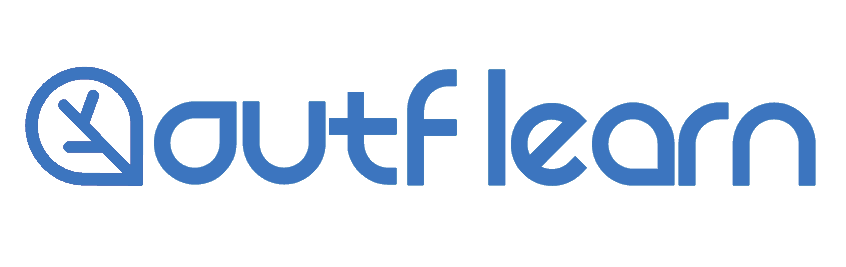

📚 온라인 강의 플랫폼 <b>Outflearn</b>
 
[프로그래머스 개인 과제 제출용]

 

  📝 개발 언어
   
  <b>[BACKEND / FRONTEND]</b>

  &nbsp 
  &nbsp 
  

  </a>&nbsp 
  </a>&nbsp 
  </a>&nbsp
  </a>&nbsp 

 

<!-- ## 📚 Outflearn -->

<!-- 사용 gif -->

<!-- |                                           메인 화면                                           |                                         결제 화면                                         |
| :-------------------------------------------------------------------------------------------: | :---------------------------------------------------------------------------------------: |
|             |      |
|                                           쿠폰 적용                                           |                                           결제                                            |
|  |  | -->
